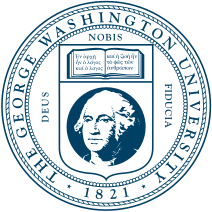

<hr>

```{=html}
<div class="affiliation">
 
 <span class="affiliation-text">The George Washington University</span>
</div>
```

<hr>

## Part 1: Claude Code Basics



## Part 2: Handy Tools



## Part 3: Workflow Construction

