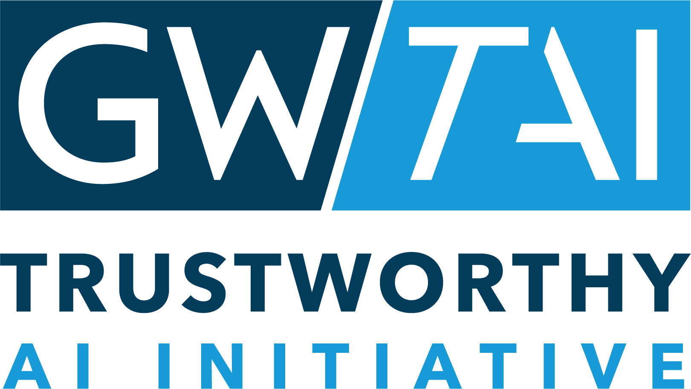



<hr>

```{=html}
<div class="affiliation">
 <a class="affiliation-logo-link" href="https://trustworthyai.gwu.edu" target="_blank" rel="noopener">
  
 </a>
 <span class="affiliation-text">The George Washington University</span>
</div>
```

<hr>

## Part 1: [Agentic Basics](basics.qmd)



## Part 2: [Skill Usage and Design](skills.qmd)



## Part 3: [Data Safety with AI](safety.qmd)


